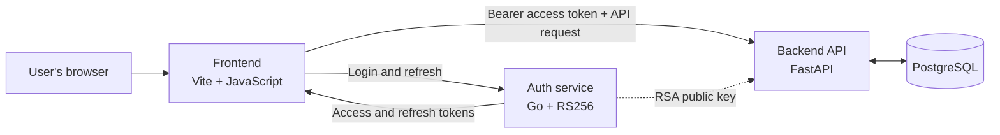

# Vehicle Fleet Management System

**VFMS** is a web application for managing fleet vehicles, drivers, vehicle assignments, maintenance history, and document expiry. This project is developed for CMPG 224 Software Engineering.

## Architecture

VFMS uses a small service-based architecture. The browser talks to the Go auth service to sign in, then sends its access token with requests to the FastAPI API. The API verifies the token locally using the auth service's public key and reads or writes fleet data in PostgreSQL.



### Request flow

1. A user signs in through the frontend. The Go auth service verifies the credentials and returns a short-lived access token and a refresh token.
2. The frontend sends the access token with API requests. When an access token expires, it attempts to refresh the session.
3. FastAPI verifies the token signature, issuer, expiry, and token type using the auth service's RSA public key. Role checks are enforced on protected routes.
4. The backend applies business rules and reads or updates PostgreSQL records. It does not call the auth service for every API request.

### Main components

| Component | Technology | Responsibility |
| --- | --- | --- |
| Frontend | Vite, vanilla JavaScript, HTML, CSS | Login, fleet views, forms, filtering, and dashboard |
| Backend | Python, FastAPI, SQLAlchemy | API, validation, role checks, fleet rules, reporting |
| Auth service | Go, RS256, bcrypt | Credential verification, token issue/refresh, public-key publishing |
| Database | PostgreSQL | Persistent vehicle, driver, assignment, maintenance, and audit data |

## Features

- Create, view, update, search, and filter vehicles and drivers.
- Assign and unassign drivers while keeping assignment history.
- Log and browse vehicle maintenance records.
- View fleet summaries, maintenance costs, and expiring licence, insurance, and roadworthy documents.
- Apply role-based access for admins, managers, and staff; driver licence details are restricted to admins and managers in driver list/get responses.

## Run locally with Docker

Docker Compose starts PostgreSQL, the Go auth service, and the FastAPI backend. The frontend runs separately with Vite.

```bash
docker compose up --build
```

In another terminal:

```bash
cd frontend
npm install
npm run dev
```

Open <http://localhost:5173>.

| Service | Local address |
| --- | --- |
| Frontend | <http://localhost:5173> |
| Backend API | <http://localhost:8001> |
| Backend OpenAPI docs | <http://localhost:8001/docs> |
| Auth service | <http://localhost:8081> |
| PostgreSQL | `localhost:5433` |

The frontend Vite proxy sends `/api` requests to the compose backend at port `8001` and `/auth` requests to the auth service. If running FastAPI directly on port `8000`, set `VFMS_API_URL=http://localhost:8000` before starting Vite.

### Demo sign-in

The auth service seeds these development accounts by default:

| Role | Email | Password |
| --- | --- | --- |
| Admin | `admin@vfms.com` | `Admin@12345` |
| Manager | `manager@vfms.com` | `Manager@12345` |
| Staff | `staff@vfms.com` | `Staff@12345` |

These accounts are for local development and demonstration only. Accounts and password changes are persisted in the auth service's `auth-data` volume. Provision real user accounts through the admin-only auth API; public self-registration is disabled.

## Data persistence

Compose stores PostgreSQL data in the `db-data` volume and auth signing keys in the `auth-keys` volume. Normal container restarts preserve both. Removing volumes (for example, `docker compose down -v`) deletes the stored database and signing keys; key removal makes existing tokens unverifiable.

The database container applies [`backend/db/schema.sql`](backend/db/schema.sql) only when it initializes an empty data directory. Backend startup creates missing tables but does not migrate existing tables. Use a database migration when changing an existing deployment schema.

## Project structure

```text
.
├── auth/                 # Go identity service and token implementation
│   ├── cmd/               # Service entry point
│   └── internal/          # Config, handlers, password, RBAC, store, tokens
├── backend/              # FastAPI fleet API
│   ├── app/
│   │   ├── middleware/    # JWT verification and role enforcement
│   │   ├── models/        # SQLAlchemy database models
│   │   ├── repositories/  # Database queries
│   │   ├── routers/       # HTTP endpoints
│   │   ├── schemas/       # Request and response validation
│   │   └── services/      # Fleet rules and audit logging
│   └── db/schema.sql      # PostgreSQL schema
├── frontend/             # Vite browser application
│   └── src/
│       ├── api/           # Backend API clients
│       ├── auth/          # Browser session and route guards
│       └── pages/         # Dashboard, vehicles, drivers, maintenance
├── docs/                  # Architecture, service, API, and test docs
├── .github/workflows/     # CI workflows
└── docker-compose.yml     # Local PostgreSQL, auth, and backend services
```

## Documentation

- [Backend guide](docs/backend.md)
- [Auth service guide](docs/auth.md)
- [Identity service API](docs/identity-service-api.md)
- [Software Design Document](docs/SDD.tex)
- [Software Requirements Specification](docs/SRS.tex)
- [Test plan](docs/test-plan.md)
- [Contributing](CONTRIBUTING.md)
